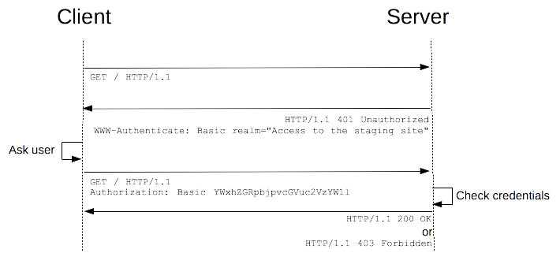

# Basic Authentication

1. client makes request to a resource that requires authorization
2. server verifies if request contains required authentication headers
  - if invalid -> status code 401 
  - if invalid -> status code 200 



### Typical request header received 

```js
// request.headers
{ host: 'localhost:3000',
  'user-agent':
   'Mozilla/5.0 (X11; Ubuntu; Linux x86_64; rv:82.0) Gecko/20100101 Firefox/82.0',
  accept:
   'text/html,application/xhtml+xml,application/xml;q=0.9,image/webp,*/*;q=0.8',
  'accept-language': 'en-US,en;q=0.5',
  'accept-encoding': 'gzip, deflate',
  dnt: '1',
  connection: 'keep-alive',
  'upgrade-insecure-requests': '1',
  'cache-control': 'max-age=0' 
}
```

### Curl auth
```bash
curl localhost:3000/api -H "Authorization: bearer admin"
```