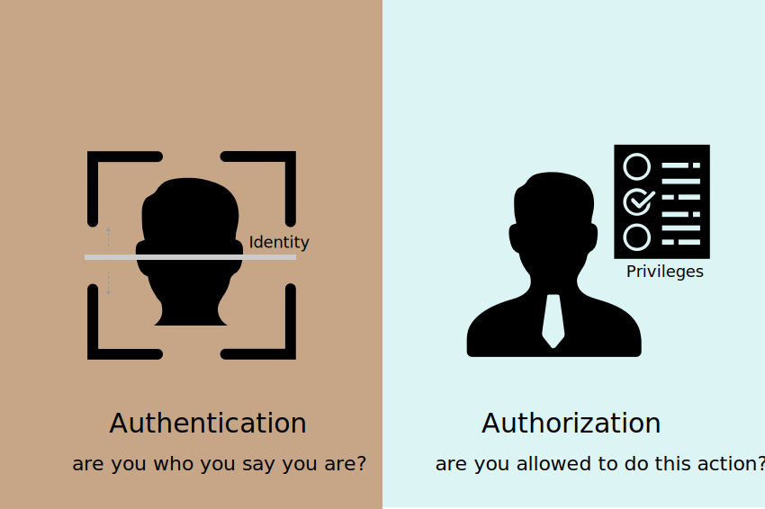

# Authentication Methods

### References
- [MDN](https://developer.mozilla.org/en-US/docs/Web/HTTP/Authentication)
- [iana](http://www.iana.org/assignments/http-authschemes/http-authschemes.xhtml)
- [risingstack blog](https://blog.risingstack.com/web-authentication-methods-explained/)

___

## Authentication Types
- HTTP
- Cookie-based
- Token-based
- Signature-based
- 1 time passwords
